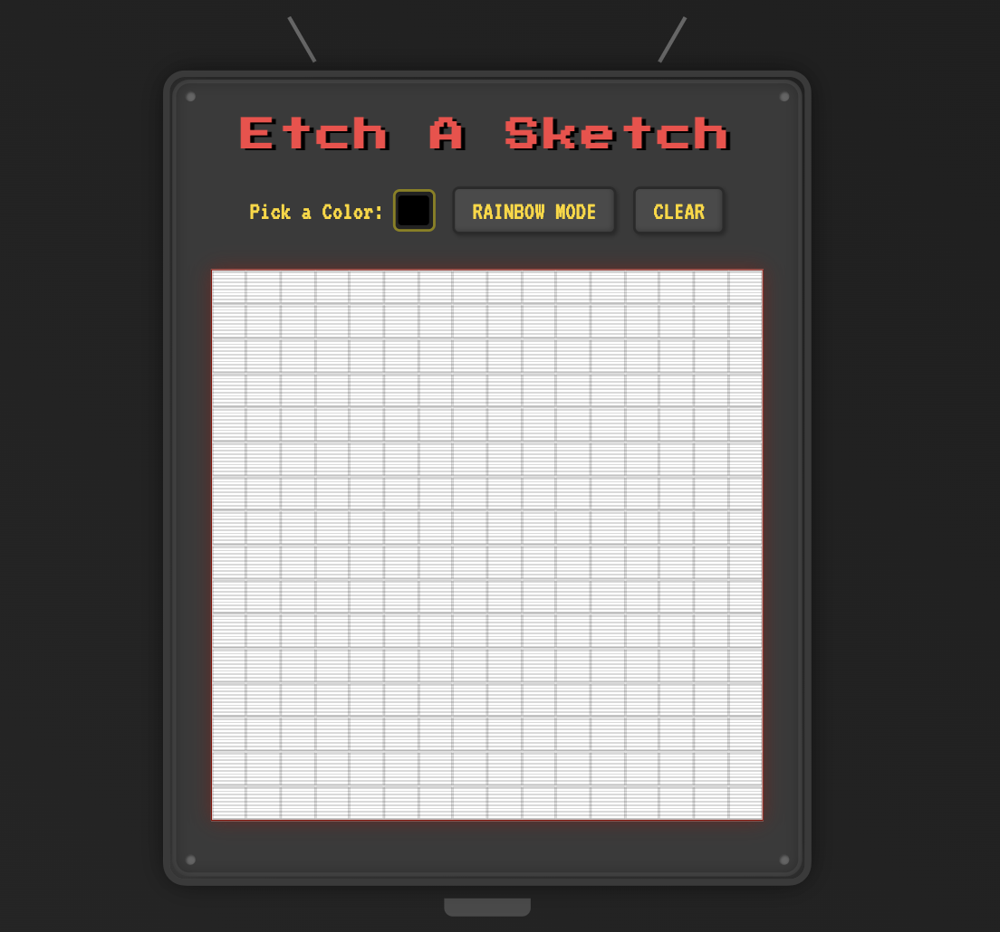

# Etch-a-Sketch

A simple browser-based drawing grid inspired by the classic Etch-A-Sketch. ✏️

## Features

- **Custom Colors:** 
- **Rainbow Mode:** 
- **Clear Screen:** 

## How to Use

1. Open `index.html` in your browser.
2. Use the color picker, buttons, and hover over the grid to draw.

Enjoy drawing! 📺